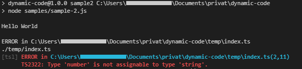

# Dynamic Code

This package is all about dynamic javascript/typescript/... systems. Dynamic here means: able to change and (re)generate code.  
Its not really about the code thats behind this package but more a way to structure a dynamic system.

## Why and When should you use Dynamic Code

Dynamic Code is usefull when there is compiled code that should change automatically.  
These changes shouldn't come in every minute, because the application would have to generate and recompile itself every time.  
Changes can be like anything like a npm package update or a content update basically anything that should be integrated into the code.  
Some [possible use cases](#possible-use-cases) are listed bellow. 

## Install

Use `npm install dynamic-code` to use Dynamic Code in your project.  
To try all the samples clone this project via `git clone https://github.com/signinit/dynamic-code.git`. Then build everything using `npm run build` and then run any of the samples via `npm run sample<NR>`.

## Prevent errors and mistakes

Dynamic Systems might produce contextual or syntax errors while running because they have the ability to change dynamically.  
To prevent these errors the use of a typed programming language is recommended.
The [Sample 2](#sample-2) demonstrates how typescript can be used to detect errors in dynamically generated and compiled code.

## Sample 1

[*sample 1 source code*](samples/sample-1.ts)  
(Use `npm run sample1` to run the full sample from bellow.)

Lets create the first Generateable. The GeneratableJSON gets any raw object and creates a Generatable from it.  
generated code.

```typescript
let value = 20 / 2
let element1 = new GeneratableJSON(value)
```

*remove generate Value from here because its not supported by the basic generateable*
The `generateValue()` gets the real value behind the Generatable. In this case its nothing special because we are dealing just with a raw value.  
`10` hould be logged to the console, which is the content of the variable `value`.

```typescript
console.log(element1.generateValue())
```

Via `generate()` code is generated from the Generatable. This should result in `[ { name: 'mainFile.ts', data: '10' } ]`.  
The result is an array of files. The `name` of the main file is speciefied in the `generate()` function. Attribute `data` of the file is the result of the generation.

```typescript
console.log(element1.generate("mainFile.ts"))
```

Now lets create a more complex combination of Generatables.  
`element1` and `element2` are merged into the Generatables `array`.

```typescript
let object = {
    text: "Hello "
}
object.text += "World"

let element2 = new GeneratableJSON(object)

let array = new GeneratableArray(element1, element2)

console.log(array.generate())
```

Logging the generated files should result in the following files.
```json
[ { "name": "index.ts", "data": "[10,{'text':'Hello World'}]" } ]
```
If no filename is specified in the `generate()` function, the function defaults to `"index.ts"`.

## Sample 2

[*sample 2 source code*](samples/sample-2.ts)  
(Use `npm run sample2` to run the full sample from bellow.)

At first lets use the `GeneratableImport` to create a generatable import for the exported function `sampleFunction` in the `samples/function.ts` file.  
The function `sampleFunction` expects a value of type `{ z: string }`. So we create a `GeneratableJSON` with that type.  
Now the function needs to be executed with the parameter.  
To bring these two generatables together we use `GeneratableFunctionExecution` with the generatable function and parameter.

```typescript
let func = new GeneratableImport(sampleFunction, new ElementImport("sampleFunction", "samples/function"))

let value: any = { z: "World" }

let parameter = new GeneratableJSON(value)

let execution = new GenertableFunctionExecution(func, parameter)
```

*The following code uses JS Promises (then & catch)*
Next we compile the generated files via typescript.  
That returns a `result` object with a `bundle.js` file as a buffer.
Getting the code as string and using `eval(...)` should execute the compiled code and print `Hello World`.

```typescript
compileTypescript(execution.generate())
    .then(result => {
        let bundledCode = result["bundle.js"].toString()
        eval(bundledCode)
    })
    .catch(error => {
        console.log(error)
    })
```

But what if we now assign the number 10 to the value of `value.z`. `value` is now a invalid parameter for `sampleFunction`.
In pure JS this would just result in `Hello 10` but the typescript definition expects a string.

```typescript
    .then(() => {
        value.z = 10
    })
    .then(() => compileTypescript(execution.generate()))
    .then(result => {
        let bundledCode = result["bundle.js"].toString()
        eval(bundledCode)
    })
    .catch(error => {
        console.log(error)
    })
```

Fortunately typescript got us covered and prevents the faulty compilation by throwing an error.
`TS2322: Type 'number' is not assignable to type 'string'.`



## Sample 3

*this sample requires some understanding of express and react which i won't go into any detail* 

Sample 3 uses react and express to create a dynamic generated web app that can be changed and automatically recompiled by the user.  
The 3 input field represent the 3 elements above.  
By clicking *change* the page will transfer the entered words and numbers to the system.  
Now the system takes these values and compiles these values into the webapp and then updates the webpage.  


## Sample 4

Sample 4 is just like Sample 3 but using the Server Side Rendering feature of React.
Dynamic code can be applied by using the HybridGeneratable which can execute the code on the server and generate the same code for the web.

## Possible use cases

### Remove network requests

Having dynamic content often means requesting the content each time it is used because it might have changed.  
For example a webpage might always request the title of the webpage, because at some point the admin may want to change it.  
Dynamic Code can help compiling the dynamic parts into the static page, so its always up to date but can be served like a static page.

### Dynamic component system in react app

React components structure an app so the individual components are managable.  
With the use of Dynamic Code they also can be changed, upgraded or swapped out complete while running.  

Maybe the user should be able to change the primary color of the app.  
Dynamic Code could be used to recompile the new color into the webapp automatically.

### Server side rendering

Just like building a dynamic web app it is possible to build a dynamic webapp that leverages server side rendering.  
Every dynamic code that is generated as "hybrid" can also be executed directly. This means the code can be run on the server side and can be served to the web.  
Obviously if your web app does not need to be dynamic there are much better tools for sole SSR.

## TBD

* sample 4 use lazy loading
* Concept for pushing changes from the generatable.
* Concept for pushing changes to the generatable.
* make Generatable and HybridGeneratable (last one can be executed and compiled to be executed)
* explain HybridGeneratable in sample 3 and only use normal Generatables in the samples above
* come up with an structure to when to generate the code and the values and when not (currently they are always regenerated)