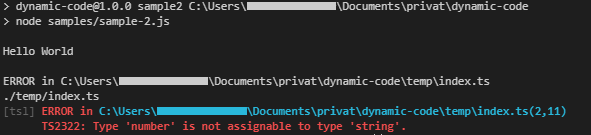

# Sample 3

[*source code*](samples/sample-3.ts)  
(Use `npm run sample3` to run the full sample from bellow.)   

At first lets use the `GeneratableImport` to create a generatable import for the exported function `sampleFunction` in the `samples/function.ts` file.  
The function `sampleFunction` expects a value of type `{ z: string }`. So we create a `GeneratableJSON` with that type.  
Now the function needs to be executed with the parameter.  
To bring these two generatables together we use `GeneratableFunctionExecution` with the generatable function and parameter.

```typescript
let func = new GeneratableImport(sampleFunction, new ElementImport("sampleFunction", "samples/function"))

let value: any = { z: "World" }

let parameter = new GeneratableJSON(value)

let execution = new GenertableFunctionExecution(func, parameter)
```

*The following code uses JS Promises (then & catch)*
Next we compile the generated files via typescript.  
That returns a `result` object with a `bundle.js` file as a buffer.
Getting the code as string and using `eval(...)` should execute the compiled code and print `Hello World`.

```typescript
compileTypescript(execution.generate())
    .then(result => {
        let bundledCode = result["bundle.js"].toString()
        eval(bundledCode)
    })
    .catch(error => {
        console.log(error)
    })
```

But what if we now assign the number 10 to the value of `value.z`. `value` is now a invalid parameter for `sampleFunction`.
In pure JS this would just result in `Hello 10` but the typescript definition expects a string.

```typescript
    .then(() => {
        value.z = 10
    })
    .then(() => compileTypescript(execution.generate()))
    .then(result => {
        let bundledCode = result["bundle.js"].toString()
        eval(bundledCode)
    })
    .catch(error => {
        console.log(error)
    })
```

Fortunately typescript got us covered and prevents the faulty compilation by throwing an error.
`TS2322: Type 'number' is not assignable to type 'string'.`



Next: [Sample 4](sample-4.md) - automatic code generation on change using `Generator`