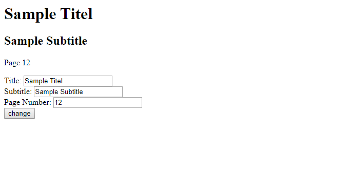

# Sample 4

[*source code*](samples/sample-4.ts)  
(Use `npm run sample4` to run the full sample from bellow.)

*this sample requires some understanding of express and react which i won't go into any detail* 

Sample 4 uses react and express to create a dynamic generated web app that can be changed and automatically recompiled by the user.  
The 3 input field represent the 3 elements above.  
By clicking *change* the page will transfer the entered words and numbers to the system.  
Now the system takes these values and compiles these values into the webapp and then updates the webpage.  

Next: [Sample 5](sample-5.md) - Server side rendering using `HybridGenerator`