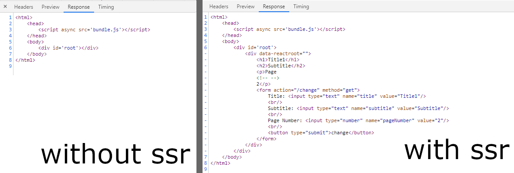

# Sample 5

[*source code*](samples/sample-5.ts)  
(Use `npm run sample5` to run the full sample from bellow.)

Sample 4 is just like Sample 3 but using the Server Side Rendering feature of React.
Dynamic code can be applied by using the HybridGeneratable which can execute the code on the server and generate the same code for the web.

